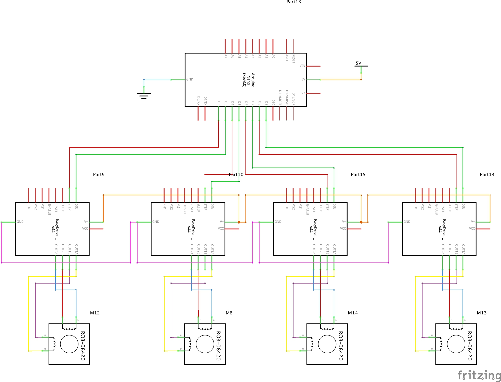
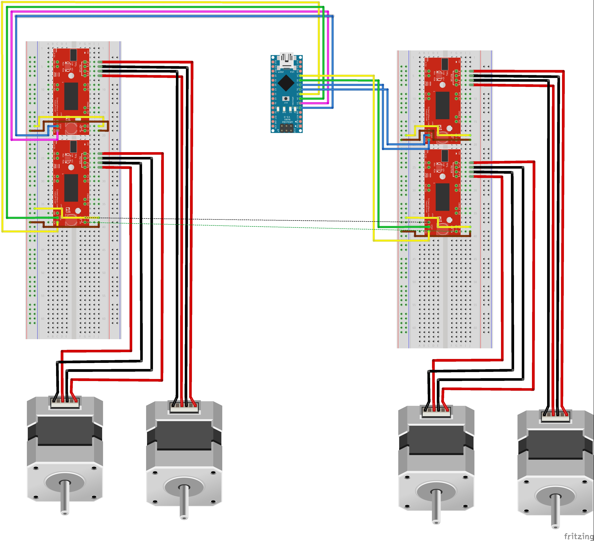

# Schematics
All schematics are made in Fritzing and use their extension (.fzz). In Fritzing are three views available:
breadboard, schematic and PCB.

## firstsetup.fzz
setup with 2 breadboards and a floating Arduino. The stepper motors are connected to an easydriver which then are connected to an Arduino.

**NOT TESTED!**

## newparts.fzz
Setup with custom parts ([source](https://github.com/tardate/X113647Stepper)). These are our actual parts. The custom made parts are also included in this repo at  `assets/schematics/customparts`.

**NOT TESTED!**
